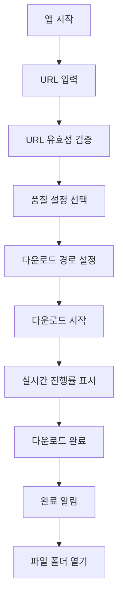
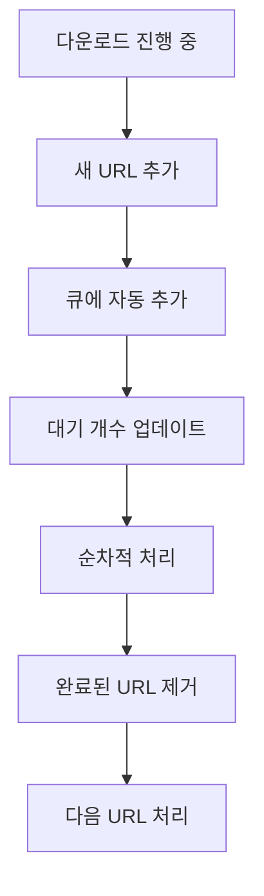

# YouTube Downloader Electron + React PRD
## Product Requirements Document

---

## 📋 **프로젝트 개요**

### **제품명**
YouTube Downloader - Electron Edition

### **버전**
v3.0.0 (Electron + React 기반 리뉴얼)

### **프로젝트 목표**
기존 Python/Tkinter 기반 YouTube Downloader를 Electron + React로 포팅하여 현대적인 UI/UX와 크로스 플랫폼 지원을 제공

### **대상 사용자**
- 기존 Python 버전 사용자
- 현대적인 UI를 선호하는 사용자
- Mac/Linux 사용자 (크로스 플랫폼 확장)

---

## 🎯 **핵심 가치 제안**

### **기존 대비 개선점**
- 🎨 **현대적인 UI**: React 기반 세련된 인터페이스
- 🔄 **동일한 기능**: 기존 yt-dlp 로직 그대로 활용
- 📦 **쉬운 배포**: 단일 실행 파일로 배포 가능
- 🌐 **크로스 플랫폼**: Windows, Mac, Linux 모두 지원
- 📱 **반응형 디자인**: 다양한 화면 크기 지원
- ⚡ **향상된 성능**: 실시간 진행률 및 부드러운 애니메이션

---

## 🔧 **기술 스택**

### **프론트엔드**
- **React 18+**: UI 컴포넌트 및 상태 관리
- **TypeScript**: 타입 안전성 및 개발 생산성
- **Styled Components**: CSS-in-JS 스타일링
- **Material-UI (MUI)**: 현대적인 UI 컴포넌트 라이브러리
- **Framer Motion**: 부드러운 애니메이션

### **데스크톱 프레임워크**
- **Electron 25+**: 크로스 플랫폼 데스크톱 앱
- **Electron Builder**: 앱 패키징 및 배포

### **백엔드 (Node.js)**
- **Node.js**: 메인 프로세스 로직
- **Child Process**: yt-dlp.exe 실행 관리
- **IPC (Inter-Process Communication)**: 프로세스 간 통신

### **외부 도구**
- **yt-dlp.exe**: YouTube 다운로드 엔진
- **FFmpeg**: 비디오/오디오 처리 (선택사항)

---

## 📱 **기능 요구사항**

### **1. 핵심 기능 (기존 기능 유지)**

#### **1.1 URL 입력 및 관리**
- ✅ 최대 10개 URL 동시 입력 지원
- ✅ 자동 순번 매기기 (1., 2., 3., ...)
- ✅ URL 붙여넣기 시 자동 줄바꿈
- ✅ 실시간 URL 유효성 검증
- ✅ 플레이스홀더 텍스트 및 예시 URL 필터링

#### **1.2 다운로드 기능**
- ✅ 순차적 다운로드 처리
- ✅ 동적 큐 시스템 (다운로드 중 URL 추가 가능)
- ✅ 실시간 진행률 표시 (개별 + 전체)
- ✅ 다운로드 중단 기능
- ✅ 완료된 URL 자동 제거

#### **1.3 품질 설정**
- ✅ 최고 품질 (단일 파일)
- ✅ 최고 품질 (병합) - FFmpeg 필요 (기본값)
- ✅ 720p HD
- ✅ 480p
- ✅ 음성만 (MP3) - FFmpeg 필요

#### **1.4 파일 관리**
- ✅ 다운로드 경로 설정
- ✅ 폴더 선택 다이얼로그
- ✅ 다운로드 폴더 바로 열기

#### **1.5 시스템 기능**
- ✅ FFmpeg 설치 상태 확인
- ✅ yt-dlp 자동 업데이트
- ✅ 실시간 로그 표시

### **2. 새로운 기능 (Electron 버전 추가)**

#### **2.1 향상된 UI/UX**
- 🆕 **드래그 앤 드롭**: URL 드래그로 추가
- 🆕 **비디오 미리보기**: 썸네일 및 제목 표시
- 🆕 **다크/라이트 모드**: 테마 전환
- 🆕 **애니메이션**: 부드러운 전환 효과
- 🆕 **반응형 레이아웃**: 창 크기에 따른 적응형 UI

#### **2.2 고급 큐 관리**
- 🆕 **드래그 앤 드롭 재정렬**: URL 순서 변경
- 🆕 **우선순위 설정**: 중요한 다운로드 우선 처리
- 🆕 **일괄 작업**: 전체 선택, 선택 삭제
- 🆕 **큐 저장/불러오기**: 다운로드 목록 저장

#### **2.3 향상된 진행률 표시**
- 🆕 **실시간 차트**: 다운로드 속도 그래프
- 🆕 **예상 완료 시간**: AI 기반 시간 예측
- 🆕 **상세 통계**: 파일 크기, 전송률, 남은 시간

#### **2.4 알림 시스템**
- 🆕 **데스크톱 알림**: 다운로드 완료 시 시스템 알림
- 🆕 **사운드 피드백**: 성공/실패 효과음
- 🆕 **시스템 트레이**: 백그라운드 실행 지원

#### **2.5 히스토리 및 관리**
- 🆕 **다운로드 히스토리**: 이전 다운로드 기록
- 🆕 **즐겨찾기**: 자주 사용하는 채널/플레이리스트
- 🆕 **검색 기능**: 제목, URL, 날짜로 검색

---

## 🎨 **UI/UX 설계**

### **메인 레이아웃**
```
┌─────────────────────────────────────────┐
│ 🎬 YouTube Downloader        [- □ ×]    │
├─────────────────────────────────────────┤
│ 📋 URL 입력 영역                        │
│ ┌─────────────────────────────────────┐ │
│ │ 🔗 URL을 입력하거나 드래그하세요     │ │
│ │                                     │ │
│ │ 1. https://youtube.com/watch?v=...  │ │
│ │ 2. https://youtube.com/watch?v=...  │ │
│ └─────────────────────────────────────┘ │
├─────────────────────────────────────────┤
│ ⚙️ 설정 영역                            │
│ 📁 [경로선택] [폴더열기] 🎛️ [품질설정]   │
├─────────────────────────────────────────┤
│ 📊 진행률 영역                          │
│ 전체: ████████░░ 80% (2/5 완료)        │
│ 현재: ██████████ 100% Rick Astley...   │
├─────────────────────────────────────────┤
│ 🎮 컨트롤 영역                          │
│ [🚀 시작] [⏸️ 일시정지] [🛑 정지]        │
├─────────────────────────────────────────┤
│ 📜 로그 영역                            │
│ ✅ 다운로드 완료: Rick Astley...        │
│ 📥 다운로드 시작: Gangnam Style...      │
└─────────────────────────────────────────┘
```

### **컴포넌트 구조**
```
App
├── Header
│   ├── Logo
│   ├── ThemeToggle
│   └── MinimizeControls
├── URLInputSection
│   ├── URLTextArea
│   ├── URLCounter
│   └── DropZone
├── SettingsSection
│   ├── PathSelector
│   ├── QualitySelector
│   └── FFmpegStatus
├── ProgressSection
│   ├── OverallProgress
│   ├── CurrentProgress
│   └── SpeedChart
├── ControlSection
│   ├── StartButton
│   ├── PauseButton
│   └── StopButton
├── LogSection
│   ├── LogViewer
│   └── LogControls
└── StatusBar
    ├── ConnectionStatus
    └── AppVersion
```

---

## 🔄 **사용자 플로우**

### **기본 다운로드 플로우**


### **동적 큐 관리 플로우**


---

## 📊 **성능 요구사항**

### **응답성**
- UI 반응 시간: < 100ms
- 다운로드 시작 시간: < 2초
- 진행률 업데이트 주기: 500ms

### **메모리 사용량**
- 기본 메모리 사용량: < 200MB
- 다운로드 중 최대 메모리: < 500MB

### **파일 크기**
- 설치 파일 크기: < 150MB
- 실행 파일 크기: < 200MB

### **호환성**
- Windows 10/11 (x64)
- macOS 10.15+ (Intel/Apple Silicon)
- Ubuntu 18.04+ / 기타 Linux 배포판

---

## 🔒 **보안 요구사항**

### **Electron 보안**
- Context Isolation 활성화
- Node Integration 비활성화
- Preload 스크립트를 통한 안전한 API 노출
- CSP (Content Security Policy) 적용

### **파일 시스템 보안**
- 사용자 지정 경로 외부 접근 차단
- 실행 파일 서명 (Code Signing)
- 자동 업데이트 시 무결성 검증

---

## 📦 **배포 요구사항**

### **패키징**
- Windows: NSIS 설치 프로그램 (.exe)
- macOS: DMG 이미지 (.dmg)
- Linux: AppImage (.AppImage)

### **자동 업데이트**
- Electron Updater 통합
- 백그라운드 업데이트 확인
- 사용자 승인 후 업데이트 적용

### **배포 채널**
- GitHub Releases (주 배포 채널)
- 공식 웹사이트 다운로드
- 향후 Microsoft Store, Mac App Store 검토

---

## 🧪 **테스트 요구사항**

### **단위 테스트**
- React 컴포넌트 테스트 (Jest + React Testing Library)
- Electron 메인 프로세스 테스트
- 유틸리티 함수 테스트

### **통합 테스트**
- IPC 통신 테스트
- 파일 다운로드 플로우 테스트
- UI 인터랙션 테스트 (Playwright)

### **E2E 테스트**
- 전체 다운로드 플로우
- 크로스 플랫폼 호환성
- 성능 벤치마크

---

## 📅 **개발 일정**

### **Phase 1: 기반 구조 (2주)**
- Electron + React 프로젝트 설정
- 기본 UI 컴포넌트 구현
- IPC 통신 구조 설계

### **Phase 2: 핵심 기능 (3주)**
- URL 입력 및 검증 시스템
- yt-dlp 통합 및 다운로드 로직
- 진행률 표시 시스템

### **Phase 3: 고급 기능 (2주)**
- 동적 큐 관리
- 드래그 앤 드롭 기능
- 테마 시스템

### **Phase 4: 최적화 및 테스트 (1주)**
- 성능 최적화
- 버그 수정
- 크로스 플랫폼 테스트

### **Phase 5: 배포 준비 (1주)**
- 패키징 및 서명
- 배포 파이프라인 구축
- 문서화

**총 개발 기간: 9주**

---

## 🎯 **성공 지표**

### **기술적 지표**
- 앱 시작 시간: < 3초
- 메모리 사용량: 기존 대비 < 2배
- 크래시율: < 0.1%

### **사용자 경험 지표**
- UI 반응성: 기존 대비 50% 향상
- 사용자 만족도: 4.5/5.0 이상
- 기능 완성도: 기존 기능 100% 구현

### **배포 지표**
- 크로스 플랫폼 지원: Windows, Mac, Linux
- 자동 업데이트 성공률: > 95%
- 설치 성공률: > 98%

---

## 🔮 **향후 로드맵**

### **v3.1 (단기)**
- 플레이리스트 일괄 다운로드
- 다운로드 스케줄링
- 클라우드 동기화 (설정)

### **v3.2 (중기)**
- 브라우저 확장 프로그램 연동
- 모바일 앱 (React Native)
- 웹 버전 (PWA)

### **v3.3 (장기)**
- AI 기반 콘텐츠 추천
- 소셜 기능 (공유, 협업)
- 플러그인 시스템

---

## 📞 **연락처 및 승인**

### **프로젝트 매니저**
- 이름: [PM 이름]
- 이메일: [PM 이메일]

### **기술 리드**
- 이름: [Tech Lead 이름]  
- 이메일: [Tech Lead 이메일]

### **승인자**
- [ ] 제품 책임자
- [ ] 기술 책임자
- [ ] 프로젝트 매니저

---

**문서 버전**: v1.0  
**작성일**: 2024년 11월 7일  
**최종 수정일**: 2024년 11월 7일